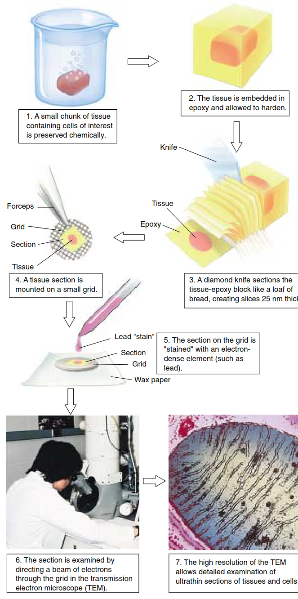

## Examining Cell Membranes  

Biologists examine the delicate, filmy structure of a cell membrane using electron microscopes that provide clear magnification to several thousand times. We discussed two types of electron microscopes in chapter 5: the transmission electron microscope (TEM) and the scanning electron microscope (SEM). When examining cell membranes with electron microscopy, specimens must be prepared for viewing.  

In one method of preparing a specimen, the tissue of choice is embedded in a hard matrix, usually some sort of epoxy (figure 6.6). The epoxy block is then cut with a microtome, a machine with a very sharp blade that makes incredibly thin slices. The knife moves up and down as the specimen advances toward it, causing transparent "epoxy shavings" less than 1 micrometer thick to peel away from the block of tissue. These shavings are placed on a grid and a beam of electrons is directed through the grid with the TEM. At the high magnification an electron microscope provides, resolution is good enough to reveal the double layers of a membrane.  

Freeze- fracturing a specimen is another way to visualize the inside of the membrane. The tissue is embedded in a medium and quick- frozen with liquid nitrogen. The frozen tissue is then "tapped" with a knife, causing a crack between the phospholipid layers of membranes. Proteins, carbohydrates, pits, pores, channels, or any other structure affiliated with the membrane will pull apart (whole, usually) and stick with one side of the split membrane. A very thin coating of platinum is then evaporated onto the fractured surface forming a replica of "cast" of the surface. Once the topography of the membrane has been preserved in the "cast," the actual tissue is dissolved away, and the "cast" is examined with electron microscopy, creating a strikingly different view of the membrane (see figure 5.10b).  

Visualizing a plasma membrane requires a very powerful electron microscope. Electrons can either be passed through a sample or bounced off it.  

FIGURE 6.6 Thin section preparation for viewing membranes with electron microscopy. 
